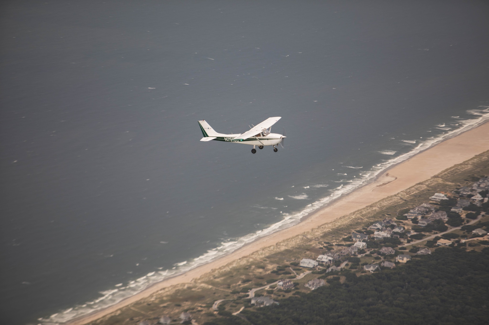
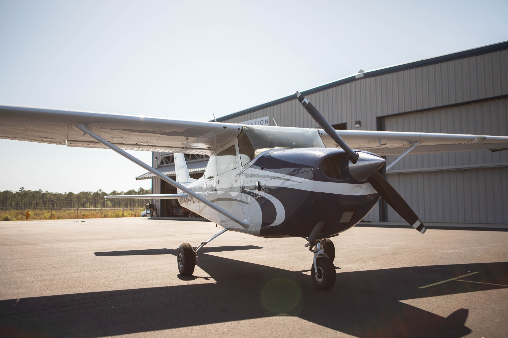

The Cessna 172 is often hailed as the quintessential training aircraft for pilots, a reputation earned through its reliability, forgiving flight characteristics, and versatility. High Tide Aviation recommends the Cessna 172 for its students due to these advantages. Here are several reasons why the Cessna 172 is considered the perfect training plane for pilots:

_Cessna 172 in flight over the beach, showcasing the versatile training environments accessible at High Tide Aviation_

### **1. Stable Flight Characteristics**

The Cessna 172 is renowned for its stable and forgiving flight characteristics, making it an ideal aircraft for beginners. Its high-wing design offers excellent stability and visibility, crucial during the learning phases of flight training at High Tide Aviation. The aircraft responds gently to control inputs and recovers smoothly from common flight errors, providing student pilots with a sense of security and confidence as they learn the ropes.

### **2. Reliability**

Built by one of the most reputable manufacturers in the industry, the Cessna 172 has a long-standing reputation for reliability. Its durable construction and robust systems ensure that it can handle the rigors of flight training, where aircraft frequently undergo numerous take-offs and landings under various conditions. This reliability reduces downtime due to maintenance, thus allowing more consistent training sessions at High Tide Aviation.

_One of our Cessna 172s taking off for another training session on the runway at High Tide Aviation_

### **3. Widespread Availability**

The Cessna 172 is one of the most produced aircraft in history, which means it is widely available at flight schools around the world, including High Tide Aviation. This ubiquity ensures that parts and maintenance expertise are readily accessible, helping keep operating costs down.

### **4. Forgiving Handling and Safety Features**

The aircraft’s forgiving nature extends to its handling characteristics, which tolerate minor pilot errors without compromising safety. Equipped with safety features such as sturdy fixed landing gear and a reliable engine, it helps manage and mitigate risks during flight training.

### **5. Instrumentation and Avionics**

Many Cessna 172 models at High Tide Aviation come equipped with modern avionics and instrumentation, providing students with the opportunity to train on equipment that they are likely to encounter in commercial and private aircraft. This includes GPS and other navigation systems, integral to modern piloting.

_Inside the cockpit of the Cessna 172, featuring the state-of-the-art avionics used in pilot training at High Tide Aviation_

### **6. Versatility**

The Cessna 172 is not only a great primary training aircraft but also capable of cross-country flying and instrument training. Its versatility means that students can continue using the same aircraft as they progress through various stages of their training, from solo flights to obtaining their instrument ratings and beyond.

### **7. Community and Support**

There is a large community of Cessna 172 pilots and enthusiasts, as well as extensive educational resources and support networks available through High Tide Aviation. New pilots can benefit from shared knowledge and experiences, which can significantly enhance their learning and development.

The Cessna 172 remains a top choice for flight training due to its forgiving nature, reliability, and versatility. Its role in pilot training at High Tide Aviation continues to be a testament to its enduring design and suitability for teaching new aviators the skills needed for a successful flying career.

[Come fly with us today](https://hightideaviation.com/enrollment-form/).

_The Cessna Skyhawk 172 parked at High Tide Aviation, ready for the next flight training session_
